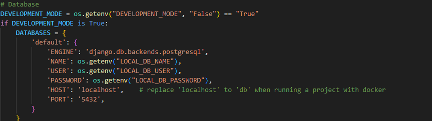

### Scalable URL Shortener


### Technologies Used
### Backend:
    - **Framework**: Django 
    - **Programming Language**: Python
    - **Database**: PostgreSQL
### Frontend:
    - **Framework**: NextJS 
    - **Programming Language**: TypeScript
#### Containerization: 
- **Docker**

### Prerequisites
- **Python 3.12.3**: Required for building and running the backend
- **Node 21.2.0**: Required for building and running the frontend
- **PostgreSQL**: For database management
- **Docker** (optional): For containerized deployment
- **IDE**: of you preference (recommend: Visual Studio Code)


### Authentication Endpoints
### 1. POST /auth/register → User Registration
    Description:
    This endpoint allows new users to register by providing their email, username, and password. Once registered, users will be able to log in and obtain access tokens.

### Request Body:
    {
      "email": "user@example.com",
      "username": "user123",
      "password": "strongpassword"
    }
### Response:

    {
      "message": "User registered successfully"
    }
### HTTP Status Codes:
    - 201 Created: User successfully registered.
    - 400 Bad Request: Invalid input or missing required fields.

### 2. POST /auth/login → User Login & JWT Token Generation
### Description:
    This endpoint allows users to log in by providing their email and password. Upon successful login, the server will generate and return JWT access and refresh tokens along with user information (email, username, and account creation date).

### Request Body:

    {
      "email": "user@example.com",
      "password": "strongpassword"
    }
### Response:

    {
      "access_token": "your_access_token",
      "refresh_token": "your_refresh_token",
      "email": "user@example.com",
      "username": "user123",
      "created_at": "2025-03-10T12:00:00Z"
    }

### HTTP Status Codes:
    - 200 OK: Successful login and token generation.
    - 400 Bad Request: Invalid credentials or missing fields.
    - 401 Unauthorized: Invalid email or password.

### 3. POST /auth/logout → Logout & Token Invalidation
    Description:
    This endpoint allows users to log out by invalidating the JWT access and refresh tokens.

### Request Headers:
    Authorization: Bearer <access_token>
    Response:

        {
          "message": "Logout successful"
        }
### HTTP Status Codes:
    - 200 OK: User successfully logged out.
    - 401 Unauthorized: Missing or invalid access token.
    - URL Shortening Endpoints

### 4. POST /shorten → Shorten URL (Authenticated Users)
    Description:
    This endpoint allows authenticated users to shorten a given URL. The user must be logged in, and the request must include a valid access token.

### Request Body:

    {
      "long_url": "https://example.com/some-long-url"
    }
### Request Headers:
    Authorization: Bearer <access_token>
    Response:
    {
      "short_url": "https://short.ly/abc123"
    }
### HTTP Status Codes:
    - 200 OK: URL successfully shortened.
    - 400 Bad Request: Invalid long URL or missing required fields.
    - 401 Unauthorized: Missing or invalid access token.
    
### URL Management Endpoints
### 5. GET /urls → Fetch User-Specific Shortened URLs
    Description:
    This endpoint allows users to fetch a list of all short URLs they have generated. The user must be authenticated and include a valid access token in the request.

### Request Headers:
    Authorization: Bearer <access_token>
    Response:

    {
      "urls": [
        {
          "short_url": "https://short.ly/abc123",
          "long_url": "https://example.com/some-long-url",
          "created_at": "2025-03-10T12:05:00Z"
        },
        {
          "short_url": "https://short.ly/xyz456",
          "long_url": "https://anotherexample.com/long-url",
          "created_at": "2025-03-09T15:00:00Z"
        }
      ]
    }
### HTTP Status Codes:
    - 200 OK: Successfully fetched user-specific URLs.
    - 401 Unauthorized: Missing or invalid access token.

### Analytics Endpoints
### 6. GET /analytics/:shortUrl → URL Analytics
    Description:
    This endpoint allows users to view analytics for a specific shortened URL. It returns device, IP address, and location data for users who accessed the short URL. The user must be authenticated and include a valid access token.

### Request Parameters:
    shortUrl: The short URL identifier (short code).
    Request Headers:
    Authorization: Bearer <access_token>
    Response:

    {
      "short_url": "https://short.ly/abc123",
      "analytics": [
        {
          "device": "mobile",
          "ip_address": "192.168.0.1",
          "location": "New York, USA",
          "timestamp": "2025-03-10T12:06:00Z"
        },
        {
          "device": "desktop",
          "ip_address": "192.168.0.2",
          "location": "Los Angeles, USA",
          "timestamp": "2025-03-09T16:00:00Z"
        }
      ]
    }
### HTTP Status Codes:
    - 200 OK: Successfully fetched URL analytics.
    - 401 Unauthorized: Missing or invalid access token.
    - 404 Not Found: Short URL does not exist or has no analytics data.


### To run the app without docker
 
### To run frontend app
- Navigate into frontend folder and then,
- first install dependencies with the following command
```bash
    npm install
```

- and then run the following command to run the server:
```bash
    npm run dev
```

### To run backend app
- Navigate into backend folder and then,
- create virtual enviropnemnt first by running the following command
```bash
    python3 -m venv env
```
- activate virtual enviropnemnt by running the following command if you are using unix system
```bash
    source env/bin/activate 
```
- activate virtual enviropnemnt by running the following command if you are using windows system
```bash
    source env/Scripts/activate 
```
-  install dependencies with the following command
```bash
    pip install -r requirements.txt
```
-  install dependencies with the following command
```bash
    pip install -r requirements.txt
```
- to run db migrations:
```bash
    pyhton manage.py makemigrations
```

- to migrate db migrations
```bash
    pyhton manage.py migrate
```

- to run server, use the following command
```bash
    pyhton manage.py runserver
```

### Dockerize
- After cloning the repository, open backend folder, navigate into urlshortener, under settings.py
and change the host of database from localhost to db as shown in the image below:

- To run docker, navigate to the root folder where yu see backend, frontend folders and docker-compose.yml
- Run the docker, by typing
 ```bash
    docker compose up --build
 ``` 
Note: I was unable to dockerize the frontend app because of time